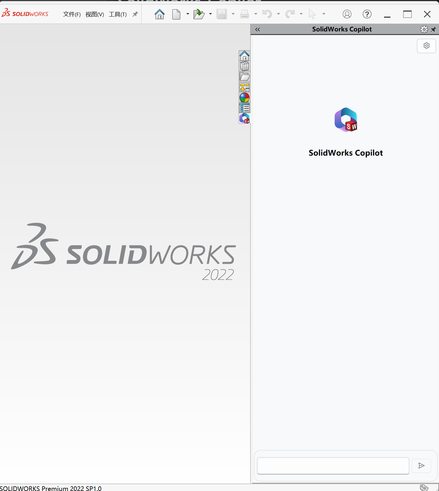

# SolidWorks-Copilot

    

**In development**

Your SolidWorks Copoilt  base on LLM(ChatGPT)

# [Semantic Kernel](https://github.com/microsoft/semantic-kernel)

SolidWorks Copilot uses Semantic Kernel to converse with the LLM model and direct the SolidWorks API.

    

# Skills

**Building...**

SolidWorks has different operational contexts, and in order for LLM to better participate in these contexts, the following workspaces have been temporarily divided for SolidWorks, and AI Skills and Native Function have been created for these workspaces.

1. Document
2. Sketch
3. Feature
4. Property
5. Assembly

# Next